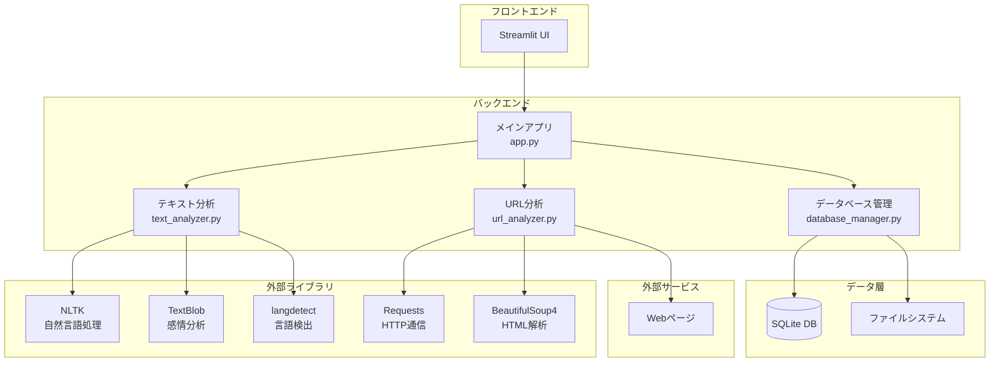
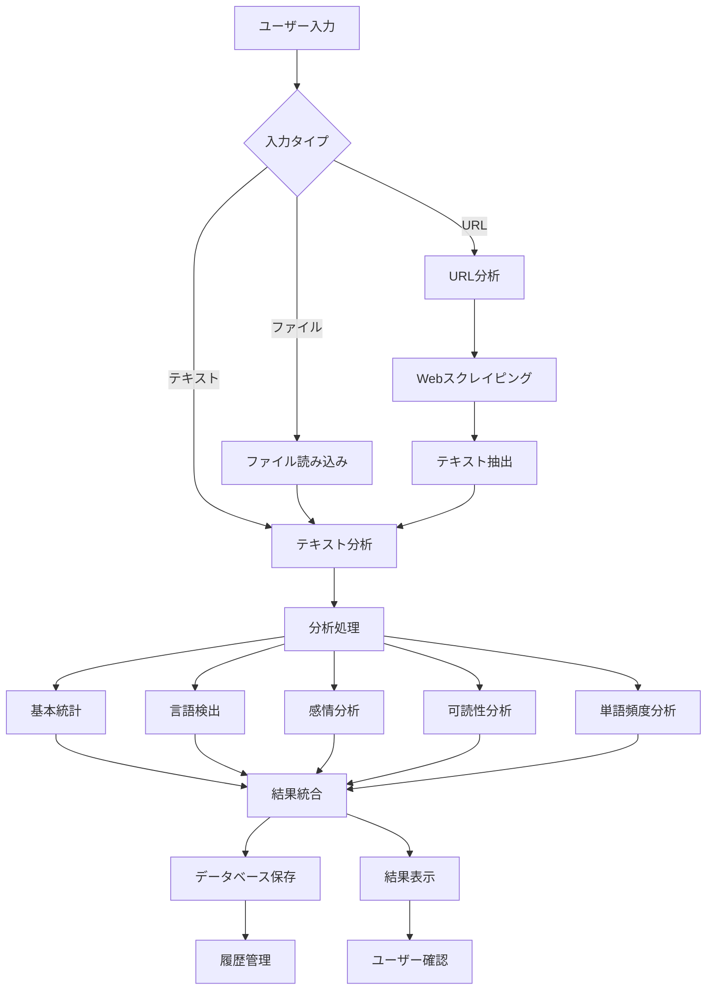
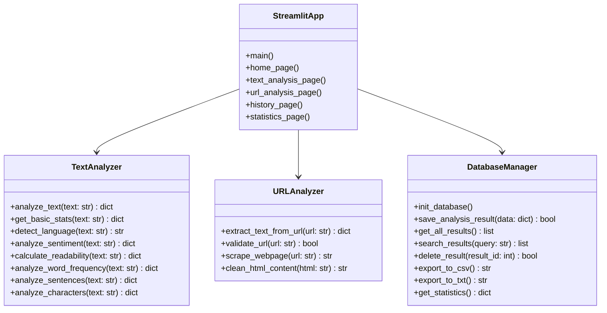
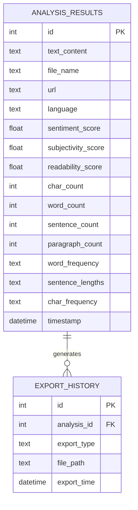

# テキスト分析アプリ

## 概要

このアプリケーションは、ユーザーが入力したテキスト、アップロードしたテキストファイル、またはWebページのURLを分析し、包括的な分析結果を提供するWebアプリケーションです。APIキーやトークンを必要としないオープンソースライブラリを使用して、テキストの詳細な分析を行います。

## 主な機能

- **基本統計**: 文字数、単語数、文の数、段落数などの基本情報
- **言語検出**: テキストの言語を自動検出
- **感情分析**: テキストの感情（ポジティブ/ネガティブ/中性）と主観性を分析
- **可読性分析**: Flesch可読性スコアによる文章の読みやすさ評価
- **単語頻度分析**: 最も頻繁に使用される単語の特定
- **文の分析**: 文の長さ分布と統計情報
- **文字分析**: 文字の使用頻度と統計情報
- **URL分析**: WebページのURLからテキストを自動抽出・分析
- **データベース機能**: 分析結果の自動保存と管理
- **エクスポート機能**: CSV/TXT形式でのデータエクスポート
- **履歴管理**: 過去の分析結果の閲覧と検索

## 使用技術

- **フレームワーク**: Streamlit
- **テキスト分析**: 
  - NLTK (Natural Language Toolkit)
  - TextBlob (感情分析)
  - langdetect (言語検出)
- **Webスクレイピング**: 
  - Requests (HTTP通信)
  - BeautifulSoup4 (HTML解析)
- **データ可視化**: Plotly
- **データ処理**: Pandas
- **データベース**: SQLite

## 使用API

このアプリケーションは**APIキーやトークンを必要としない**オープンソースライブラリのみを使用しています：

- **NLTK**: 自然言語処理（トークン化、ストップワード）
- **TextBlob**: 感情分析
- **langdetect**: 言語検出
- **Requests**: HTTP通信（Webページ取得）
- **BeautifulSoup4**: HTML解析（Webページからテキスト抽出）

## インストール方法

1. リポジトリをクローン
```bash
git clone <repository-url>
cd 22060004_ogawa_kadai2
```

2. 依存関係をインストール
```bash
pip install -r requirements.txt
```

3. アプリケーションを起動
```bash
# Windows環境の場合
start_app.bat
# または
start_app.ps1

# 直接実行の場合
streamlit run app.py
```

## 使用方法

### 🏠 ホームページ
- アプリケーションの概要と統計情報を表示
- 総分析数、平均テキスト長、最も一般的な言語、平均感情スコアを確認
- クイック分析機能（テキスト入力、ファイルアップロード、URL分析）

### 📝 テキスト分析
1. 入力方法を選択：
   - **テキスト入力**: テキストエリアに直接入力
   - **ファイルアップロード**: テキストファイル（.txt）をアップロード
   - **URL分析**: WebページのURLを入力
2. 「分析開始」ボタンをクリック
3. 分析結果が自動的にデータベースに保存される
4. 詳細な分析結果をタブ形式で確認

### 🌐 URL分析機能
- **URL入力**: WebページのURLを入力（https://example.com または example.com）
- **ページ情報表示**: タイトル、説明、文字数を事前に表示
- **テキスト抽出**: メインコンテンツを自動抽出
- **分析実行**: 抽出されたテキストを詳細分析

### 📚 分析履歴
- 過去の分析結果を一覧表示
- 検索機能で特定の分析を検索
- 言語別フィルタリング
- 分析結果の詳細表示と削除

### 📊 統計情報
- 全分析データの統計情報
- 言語分布の円グラフ
- 感情分布の棒グラフ
- テキスト長の分布ヒストグラム

### 💾 データ管理
- **CSVエクスポート**: 全分析データをCSV形式でダウンロード
- **TXTエクスポート**: 詳細な分析結果をTXT形式でダウンロード
- **データ削除**: 個別または全データの削除

## プロジェクト構造

```
22060004_ogawa_kadai2/
├── app.py                 # メインStreamlitアプリケーション
├── deploy.py              # Streamlit Cloudデプロイ用エントリーポイント
├── requirements.txt       # Python依存関係
├── .streamlit/            # Streamlit設定
│   └── config.toml       # デプロイ設定
├── src/                   # コアモジュール
│   ├── __init__.py       # パッケージ初期化
│   ├── text_analyzer.py  # テキスト分析エンジン
│   ├── database_manager.py # データベース管理
│   └── url_analyzer.py   # URL分析・Webスクレイピング
├── start_app.bat          # Windows起動スクリプト（コマンドプロンプト）
├── start_app.ps1          # Windows起動スクリプト（PowerShell）
├── README.md              # プロジェクト概要
├── README_Deploy.md       # デプロイ手順
├── README_Windows.md      # Windows環境での使用方法
└── .gitignore             # Git除外設定
```

## システム設計図

### システムアーキテクチャ



### データフロー図



### クラス図



### データベース設計



## URL分析機能の詳細

### 対応URL形式
- **完全URL**: https://example.com
- **簡易URL**: example.com（自動的にhttps://を追加）
- **サブドメイン**: blog.example.com
- **パス付きURL**: example.com/page/article

### テキスト抽出アルゴリズム
1. **メインタグ優先**: `<main>`タグからテキストを抽出
2. **記事タグ次点**: `<article>`タグからテキストを抽出
3. **ボディ全体**: 上記がない場合は`<body>`全体から抽出
4. **不要要素除去**: `<script>`, `<style>`, `<nav>`, `<header>`, `<footer>`, `<aside>`を除外

### エラーハンドリング
- **接続エラー**: ネットワーク接続の問題
- **タイムアウト**: 10秒でタイムアウト
- **無効URL**: URL形式の検証
- **空コンテンツ**: テキストが抽出できない場合

## データベース機能

### 保存される情報
- **分析結果**: すべての分析データが自動保存
- **メタデータ**: タイムスタンプ、ファイル名、テキスト長
- **URL情報**: URL分析の場合はURLも保存
- **統計情報**: 言語、感情、可読性などの詳細データ

### エクスポート機能
- **CSV形式**: 分析結果の要約データ
- **TXT形式**: 詳細な分析結果（人間が読みやすい形式）

### データ管理
- **検索機能**: ファイル名やテキスト内容での検索
- **フィルタリング**: 言語別フィルタリング
- **削除機能**: 個別データの削除


## 開発者向け情報

### アーキテクチャ

- **フロントエンド**: Streamlit（PythonベースのWebフレームワーク）
- **バックエンド**: Python（テキスト分析ロジック）
- **データ可視化**: Plotly（インタラクティブなグラフ）
- **データベース**: SQLite（軽量なリレーショナルデータベース）
- **Webスクレイピング**: Requests + BeautifulSoup4

### 拡張可能な機能

- 新しい分析機能の追加
- より多くの言語対応
- リアルタイム分析
- バッチ処理機能
- クラウドストレージ連携
- ユーザー認証機能
- より高度なWebスクレイピング機能

## 改善案・将来計画

### 📈 夏休み課題の改善案

本プロジェクトの将来の発展に向けた包括的な改善案を策定しました。個人向けツールから企業・教育機関向けの本格的なテキスト分析プラットフォームへの発展を目指します。

**[📋 改善案詳細はこちら](improvement.md)**

改善案では以下の内容を詳しく解説しています：

- **サービスの立ち位置見直し**: 個人利用から企業向けプラットフォームへ
- **システム化に必要な追加実装**: ユーザー認証、マルチテナント対応、AI/ML機能など
- **技術スタック詳細**: 推奨技術とアーキテクチャ設計
- **実装ロードマップ**: 段階的な開発計画
- **期待される効果**: ビジネス・技術・ユーザー価値の向上

### 主な改善ポイント

1. **🔐 ユーザー認証・認可システム**
   - メール認証、二要素認証
   - ロールベースアクセス制御
   - ソーシャルログイン対応

2. **🏢 マルチテナント対応**
   - 組織・チーム管理
   - データ分離・プライバシー保護
   - リソース管理・課金システム

3. **🤖 高度なAI/ML機能**
   - トピックモデリング、エンティティ認識
   - 精度向上した感情分析
   - 予測分析・コンテンツ最適化

4. **⚡ リアルタイム分析・監視**
   - ストリーミング処理
   - リアルタイムダッシュボード
   - アラート・通知システム

5. **🔗 データ統合・連携**
   - 外部データソース連携
   - ETL処理・データパイプライン
   - データレイク・データウェアハウス

6. **📱 モダンなUI/UX**
   - レスポンシブデザイン
   - モバイルアプリ対応
   - アクセシビリティ対応

詳細な実装計画や技術仕様については、[improvement.md](improvement.md)をご覧ください。