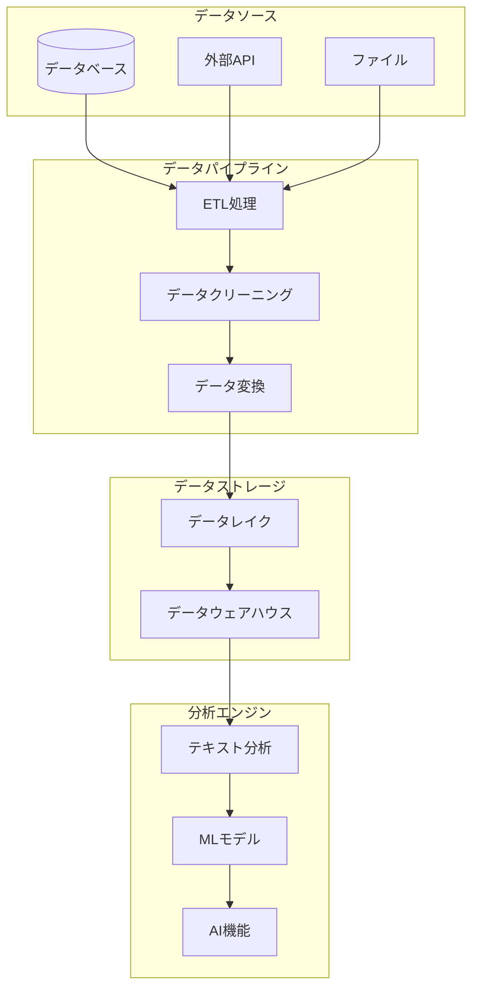

# 夏休み課題の改善案

## 概要

現在のテキスト分析アプリケーションは、基本的なテキスト分析機能を提供する個人向けツールとして開発されています。本改善案では、サービスの立ち位置を**個人利用から企業・教育機関向けの本格的なテキスト分析プラットフォーム**へと発展させ、システム化に必要な追加実装を明らかにします。

## 1. サービスの立ち位置の見直し

### 1.1 現在の立ち位置
- **個人向けツール**: 単発のテキスト分析
- **ローカル実行**: ユーザーのPC上でのみ動作
- **基本的な分析**: 統計情報、感情分析、可読性分析
- **データ管理**: ローカルSQLiteデータベース

### 1.2 目標とする立ち位置
- **企業・教育機関向けプラットフォーム**: 継続的なテキスト分析サービス
- **クラウドベース**: 複数ユーザーが同時利用可能
- **高度な分析**: AI/MLを活用した深い洞察
- **データ統合**: 複数ソースからのデータ統合・分析

### 1.3 市場分析と競合状況

#### 競合の存在確認
**結論: 競合は多数存在するが、特定のニッチで差別化可能**

**主要競合:**
- **海外**: IBM Watson, Google Cloud NL, Amazon Comprehend, MonkeyLearn
- **日本**: ユーザーローカル, エン・ジャパン, 富士通, NEC

**市場ギャップ:**
1. **日本語特化の統合プラットフォーム不足**
2. **教育機関向けの特化ソリューション不足**
3. **中小企業向けの統合ソリューション不足**

#### 差別化戦略
- **「日本語ビジネス特化」**: 日本のビジネス文脈を深く理解
- **「誰でも使える分析」**: 専門知識不要の直感的操作
- **「段階的成長対応」**: 個人から企業まで対応

詳細な市場分析については、[市場分析レポート](market_analysis.md)をご参照ください。

## 2. 課題解決の明確化（Who-What-How）

### 2.1 Who（誰の課題を解決するのか）

#### プライマリターゲット
1. **中小企業のマーケティング・営業担当者**
   - 従業員数: 10-100名
   - 予算: 月額5-20万円程度
   - 特徴: 専門知識不足、コスト重視

2. **教育機関の教職員・管理者**
   - 大学・専門学校・高校
   - 学生数: 100-5,000名
   - 特徴: 教育効果の可視化ニーズ、予算制約

3. **個人事業主・フリーランサー**
   - ブロガー、コンサルタント、コピーライター
   - 特徴: 低コスト、簡単操作、即座に結果が必要

### 2.2 What（どんな課題を解決するのか）

#### 課題1: 専門知識の壁
- 既存ツールは専門知識が必要
- 設定が複雑で学習コストが高い
- 結果の解釈が困難

#### 課題2: コストの壁
- エンタープライズツールは高額（月額50万円以上）
- 初期導入コストが高い
- 使用量に応じた課金で予算管理が困難

#### 課題3: 日本語対応の不十分さ
- 海外ツールの日本語精度が低い
- 日本のビジネス文脈を理解しない
- 敬語・方言・業界用語に対応していない

#### 課題4: 既存システムとの連携不足
- データの取り込みが手作業
- 既存のCRM・SFAとの連携が困難
- 分析結果の活用が限定的

### 2.3 How（どのように解決するのか）

#### 解決策1: 直感的なUI/UX設計
- **ワンクリック分析**: 複雑な設定なしで即座に分析開始
- **結果の可視化**: グラフとチャートで直感的に理解
- **ガイド機能**: ステップバイステップの操作案内

#### 解決策2: 段階的価格設定
- **フリーミアム**: 月100件まで無料
- **スタータープラン**: 月額9,800円（月1,000件）
- **ビジネスプラン**: 月額29,800円（月10,000件）

#### 解決策3: 日本語特化の高精度分析
- **日本語NLPモデル**: BERT日本語版をベースとした独自モデル
- **業界用語辞書**: 業界別の専門用語データベース
- **文脈理解**: 敬語・方言・ビジネス文脈の適切な処理

#### 解決策4: 既存システムとのシームレス連携
- **API連携**: RESTful APIで既存システムと連携
- **プラグイン**: 主要なCRM・SFA向けプラグイン
- **データ同期**: 自動的なデータ取り込み・更新

## 3. システム化に必要な追加実装

### 3.1 ユーザー認証・認可システム

#### 2.1.1 実装すべき機能
- **ユーザー登録・ログイン**
  - メールアドレス認証
  - パスワード管理（ハッシュ化）
  - 二要素認証（2FA）
  - ソーシャルログイン（Google、Microsoft）

- **ロールベースアクセス制御（RBAC）**
  - 管理者（Admin）
  - 分析者（Analyst）
  - 閲覧者（Viewer）
  - ゲスト（Guest）

- **セッション管理**
  - JWT（JSON Web Token）ベースの認証
  - セッションタイムアウト
  - 複数デバイス対応

#### 2.1.2 技術スタック
```python
# 推奨ライブラリ
- FastAPI + SQLAlchemy（バックエンドAPI）
- JWT + bcrypt（認証・暗号化）
- OAuth2（ソーシャルログイン）
- Redis（セッション管理）
```

### 2.2 マルチテナント対応

#### 2.2.1 実装すべき機能
- **組織・チーム管理**
  - 組織の作成・管理
  - チームメンバーの招待・管理
  - 組織レベルの設定

- **データ分離**
  - テナント別データベース分離
  - データアクセス制御
  - プライバシー保護

- **リソース管理**
  - 組織別の利用制限
  - 使用量監視
  - 課金システム連携

#### 2.2.2 データベース設計
```sql
-- 組織テーブル
CREATE TABLE organizations (
    id UUID PRIMARY KEY,
    name VARCHAR(255) NOT NULL,
    domain VARCHAR(255),
    created_at TIMESTAMP,
    updated_at TIMESTAMP
);

-- ユーザー組織関連テーブル
CREATE TABLE user_organizations (
    user_id UUID,
    organization_id UUID,
    role VARCHAR(50),
    joined_at TIMESTAMP,
    PRIMARY KEY (user_id, organization_id)
);
```

### 2.3 高度な分析機能

#### 2.3.1 AI/ML機能の追加
- **自然言語処理の高度化**
  - トピックモデリング（LDA、BERT）
  - エンティティ認識（NER）
  - キーワード抽出
  - 要約生成

- **感情分析の精度向上**
  - 細かい感情分類（喜び、悲しみ、怒り、恐れ、驚き、嫌悪）
  - 文脈を考慮した感情分析
  - 時系列での感情変化追跡

- **予測分析**
  - テキストの品質スコア予測
  - 読者反応予測
  - コンテンツ最適化提案

#### 2.3.2 実装すべき機能
```python
# 高度な分析クラス
class AdvancedTextAnalyzer:
    def __init__(self):
        self.topic_model = None
        self.ner_model = None
        self.sentiment_classifier = None
    
    def analyze_topics(self, texts):
        # トピックモデリング
        pass
    
    def extract_entities(self, text):
        # エンティティ認識
        pass
    
    def generate_summary(self, text):
        # 要約生成
        pass
    
    def predict_engagement(self, text):
        # エンゲージメント予測
        pass
```

### 2.4 リアルタイム分析・監視

#### 2.4.1 実装すべき機能
- **リアルタイムデータ処理**
  - WebSocket接続
  - ストリーミング分析
  - リアルタイムダッシュボード

- **アラート・通知システム**
  - 異常値検知
  - 閾値超過通知
  - メール・Slack通知

- **監視・ログ機能**
  - システム監視
  - ユーザー行動ログ
  - パフォーマンス監視

#### 2.4.2 技術スタック
```python
# リアルタイム処理
- Apache Kafka（メッセージング）
- Apache Spark（ストリーミング処理）
- WebSocket（リアルタイム通信）
- Prometheus + Grafana（監視）
```

### 2.5 データ統合・連携

#### 2.5.1 実装すべき機能
- **外部データソース連携**
  - データベース接続（MySQL、PostgreSQL、MongoDB）
  - API連携（REST、GraphQL）
  - ファイル連携（CSV、Excel、JSON）

- **データパイプライン**
  - ETL処理
  - データクリーニング
  - データ変換・正規化

- **データレイク・データウェアハウス**
  - 大容量データ保存
  - データ履歴管理
  - データバージョニング

#### 2.5.2 アーキテクチャ


### 2.6 スケーラビリティ・パフォーマンス

#### 2.6.1 実装すべき機能
- **マイクロサービス化**
  - 認証サービス
  - 分析サービス
  - データサービス
  - 通知サービス

- **負荷分散・スケーリング**
  - ロードバランサー
  - 水平スケーリング
  - オートスケーリング

- **キャッシュ戦略**
  - Redis キャッシュ
  - CDN（Content Delivery Network）
  - データベースクエリ最適化

#### 2.6.2 インフラ構成
```yaml
# Docker Compose例
version: '3.8'
services:
  auth-service:
    image: text-analyzer/auth:latest
    ports:
      - "8001:8000"
  
  analysis-service:
    image: text-analyzer/analysis:latest
    ports:
      - "8002:8000"
  
  data-service:
    image: text-analyzer/data:latest
    ports:
      - "8003:8000"
  
  redis:
    image: redis:alpine
    ports:
      - "6379:6379"
  
  postgres:
    image: postgres:13
    environment:
      POSTGRES_DB: text_analyzer
      POSTGRES_USER: admin
      POSTGRES_PASSWORD: password
```

### 2.7 セキュリティ強化

#### 2.7.1 実装すべき機能
- **データ暗号化**
  - 保存時暗号化（AES-256）
  - 通信時暗号化（TLS 1.3）
  - キー管理（AWS KMS、Azure Key Vault）

- **アクセス制御**
  - IP制限
  - API レート制限
  - 不正アクセス検知

- **監査ログ**
  - 全操作のログ記録
  - データアクセス追跡
  - セキュリティイベント監視

#### 2.7.2 セキュリティチェックリスト
- [ ] SQLインジェクション対策
- [ ] XSS（Cross-Site Scripting）対策
- [ ] CSRF（Cross-Site Request Forgery）対策
- [ ] セキュアなパスワードポリシー
- [ ] 定期的なセキュリティ監査
- [ ] 脆弱性スキャン
- [ ] ペネトレーションテスト

### 2.8 ユーザビリティ・UI/UX改善

#### 2.8.1 実装すべき機能
- **モダンなUI/UX**
  - レスポンシブデザイン
  - ダークモード対応
  - アクセシビリティ対応

- **インタラクティブなダッシュボード**
  - ドラッグ&ドロップ機能
  - カスタマイズ可能なウィジェット
  - リアルタイム更新

- **モバイルアプリ**
  - iOS/Android ネイティブアプリ
  - オフライン機能
  - プッシュ通知

#### 2.8.2 技術スタック
```javascript
// フロントエンド
- React.js + TypeScript
- Material-UI / Ant Design
- Redux Toolkit（状態管理）
- React Query（データフェッチ）

// モバイル
- React Native
- Flutter
- ネイティブ開発（Swift/Kotlin）
```

## 3. 実装ロードマップ

### Phase 1: 基盤構築（3-4ヶ月）
1. **ユーザー認証システム**
   - 基本的な登録・ログイン機能
   - JWT認証
   - パスワード管理

2. **データベース設計**
   - マルチテナント対応
   - ユーザー・組織管理
   - データ分離

3. **API設計**
   - RESTful API
   - OpenAPI仕様
   - 認証・認可

### Phase 2: 高度な分析機能（2-3ヶ月）
1. **AI/ML機能追加**
   - トピックモデリング
   - エンティティ認識
   - 高度な感情分析

2. **データ統合**
   - 外部データソース連携
   - ETL処理
   - データパイプライン

3. **リアルタイム分析**
   - ストリーミング処理
   - リアルタイムダッシュボード
   - アラート機能

### Phase 3: スケーラビリティ・セキュリティ（2-3ヶ月）
1. **マイクロサービス化**
   - サービス分割
   - コンテナ化
   - オーケストレーション

2. **セキュリティ強化**
   - 暗号化
   - 監査ログ
   - 脆弱性対策

3. **パフォーマンス最適化**
   - キャッシュ戦略
   - データベース最適化
   - CDN導入

### Phase 4: UI/UX・モバイル（2-3ヶ月）
1. **フロントエンド刷新**
   - モダンなUI/UX
   - レスポンシブデザイン
   - アクセシビリティ

2. **モバイルアプリ**
   - ネイティブアプリ開発
   - オフライン機能
   - プッシュ通知

3. **ユーザビリティ向上**
   - ユーザーテスト
   - フィードバック収集
   - 継続的改善

## 4. 技術スタック詳細

### 4.1 バックエンド
```python
# 推奨技術スタック
- フレームワーク: FastAPI / Django REST Framework
- データベース: PostgreSQL + Redis
- 認証: JWT + OAuth2
- メッセージング: Apache Kafka / RabbitMQ
- 監視: Prometheus + Grafana
- ログ: ELK Stack (Elasticsearch, Logstash, Kibana)
```

### 4.2 フロントエンド
```javascript
// 推奨技術スタック
- フレームワーク: React.js + TypeScript
- 状態管理: Redux Toolkit + RTK Query
- UIライブラリ: Material-UI / Ant Design
- チャート: Chart.js / D3.js
- テスト: Jest + React Testing Library
```

### 4.3 インフラ・DevOps
```yaml
# 推奨技術スタック
- コンテナ: Docker + Kubernetes
- CI/CD: GitHub Actions / GitLab CI
- クラウド: AWS / Azure / GCP
- 監視: Prometheus + Grafana
- ログ: ELK Stack
- セキュリティ: Vault / AWS Secrets Manager
```

## 5. 期待される効果

### 5.1 ビジネス価値
- **収益化**: サブスクリプションモデル、従量課金
- **市場拡大**: 企業・教育機関への展開
- **競合優位性**: 高度なAI機能による差別化

### 5.2 技術的価値
- **スケーラビリティ**: 大量データ処理対応
- **信頼性**: 高可用性・障害対応
- **セキュリティ**: 企業レベルのセキュリティ

### 5.3 ユーザー価値
- **利便性**: 直感的なUI/UX
- **柔軟性**: カスタマイズ可能な分析
- **アクセシビリティ**: モバイル・オフライン対応

## 6. リスク・課題

### 6.1 技術的リスク
- **複雑性の増大**: マイクロサービス化による管理コスト
- **パフォーマンス**: 大量データ処理時の性能問題
- **セキュリティ**: クラウド環境でのセキュリティリスク

### 6.2 ビジネスリスク
- **開発コスト**: 大規模な機能追加によるコスト増
- **市場競争**: 既存プレイヤーとの競合
- **ユーザー受け入れ**: 複雑化によるユーザビリティ低下

### 6.3 対策
- **段階的実装**: リスクを分散した段階的開発
- **ユーザーフィードバック**: 継続的なユーザーテスト
- **技術的負債管理**: 定期的なリファクタリング

## 7. まとめ

本改善案では、現在の個人向けテキスト分析ツールを、企業・教育機関向けの本格的なテキスト分析プラットフォームへと発展させるための包括的な計画を提示しました。

**重要なポイント:**
1. **段階的アプローチ**: リスクを最小化しながら段階的に機能を追加
2. **技術的負債の管理**: 既存コードの品質を保ちながら新機能を追加
3. **ユーザー中心設計**: 技術的な複雑さを隠し、直感的なUI/UXを提供
4. **セキュリティファースト**: 企業利用を前提としたセキュリティ設計

この改善案に基づいて実装を進めることで、競合優位性のあるテキスト分析プラットフォームの構築が可能になります。
